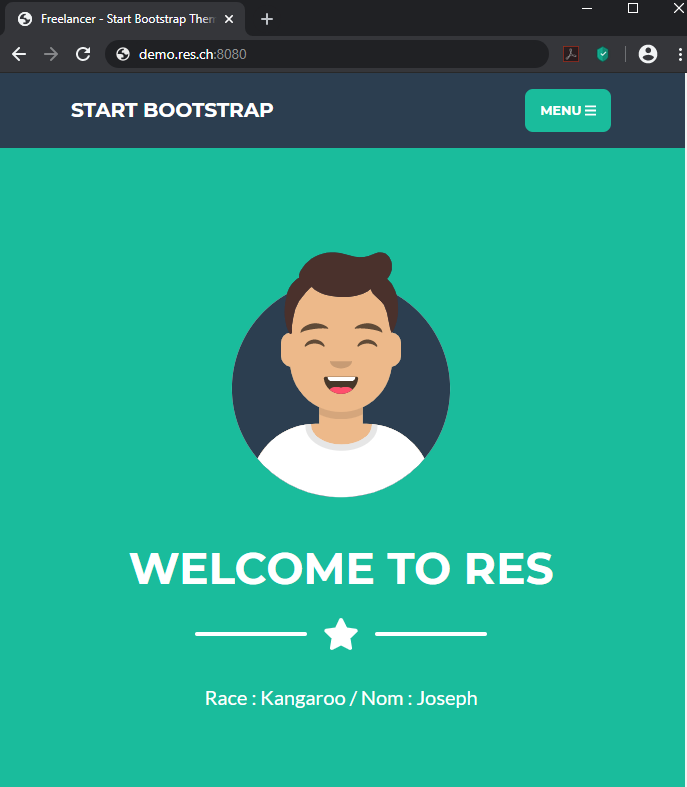

# RES 2020 Labo HTTP-Infra

**Auteurs : Christian Zaccaria, Nenad Rajic**

# Instructions et Objectifs
L'objectif de ce laboratoire est de pouvoir se familiariser avec les outils logiciels qui permettent de construire une infrastructure Web : c'est à dire un environnement permettant de fournir du contenu statique et dynamique aux navigateurs web. Pour cela, nous utiliserons _Serveur Apache httpd_ (pouvant agir à la fois comme serveur HTTP et reverse proxy) ainsi que _express.js_ (framework JS facilitant l'écriture d'applications web dynamiques).

Le deuxième objectif est de pouvoir mettre en œuvre une application web simple, complète et dynamique. Nous créons alors des ressources HTML, CSS et JS qui seront transmises aux navigateurs et présentées aux différents utilisateurs. Le code JavaScript exécuté dans le navigateur émettra des requêtes HTTP asynchrones à notre infrastructure Web (requêtes AJAX) et récupéra le contenu généré de manière dynamique. 

Finalement, ce laboratoire permet de pratiquer l'utilisation de Docker : pour ce faire tous les composants de l'infrastructure web sont regroupés dans différents images Docker personnalisées. (3 images différentes au minimum).

**Il est important de noter que notre laboratoire a été réalisé à l'aide de _Docker Desktop for Windows, version 2.3.0.2_.** 

# Step 1 : Static HTTP server with apache httpd

<u>**But**</u>

Installer un serveur apache (httpd) et le configurer tout en y ajoutant du contenu static HTML récupéré depuis le site web <https://startbootstrap.com/themes/> en utilisant Docker.

<u>**Réalisation**</u> 

Pour commencer, nous crééons une branche à partir du master nommée _fb-apache-static_, ceci afin de nous permettre de mettre en place cette première étape du laboratoire. Pour cette réalisation, nous avons créé un fichier Dockerfile et y avons écrit les lignes nous permettant de récupérer une image du _DockerHub_ contenant le serveur **httpd** et **PHP** mis à disposition : nous avons pris donc l'image officielle de **PHP** incluant aussi le server **httpd** 

Voici donc notre fichier Dockerfile:

```bash
FROM php:7.2-apache

COPY content/ /var/www/html/
```

La première ligne nous permet de récupérer notre image **httpd** et **PHP** avec la version 7.2 *d'apache* et la seconde ligne va copier notre dossier local `content`, contenant le dossier complet du site web static téléchargé depuis le site startbootstrap et modifié au préalable, dans le dossier `/var/www/html/` du container Docker.

Nous avons décidé de prendre le thème _FreeLancer_ sur _Boostrap_ et de le personnalisé afin qu'il soit à l'image de notre magnifique laboratoire de RES.

<u>**Test**</u>  

On ouvre une invite de commande à l'endroit où se trouve le fichier Dockerfile afin de créer une image et de lancer le container à partir de cette dernière comme suit: 

```
docker build -t res/apache_php .
docker run -d -p 9090:80 res/apache_php
```

Le paramètre `-d` n'est pas vraiment nécessaire (pas présent dans les podcasts), mais nous préferons l'utiliser afin de lancer le container en arrière plan. 

Il faut ensuite ouvrir un navigateur web, taper: `http://localhost:9090/` et le contenu web static s'affiche. 


# Step 2: Dynamic HTTP server with express.js

<u>**But**</u>

Mise en place une application web dynamique avec **Node.js** qui va retourner des données *JSON*. Cette application dockerisée va donc parler **HTTP** et fournir des données *JSON* à différents clients.

<u>**Réalisation**</u>

En premier, nous avons créé une branche *fb-express-dynamic* à partir de la branche *fb-apache-static*. Puis, comme à l'étape précédente, nous avons mis en place un fichier Dockerfile comme suit: 

```bash
FROM node:12.16

COPY src /opt/app

CMD ["node", "opt/app/index.js"]
```

La premièrer ligne permet de récupérer l'image Node version 12.16 depuis le *DockerHub* (dernière version LTS de **Node.js**), puis copier le contenu du dossier local `src` dans le dossier `/opt/app` du container Docker. Finalement la dernière ligne va nous permettre de lancer la commande `node index.js` à chaque démarrage du container.

Ensuite, à l'emplacement du fichier Dockerfile, nous avons créé un dossier `src` et y avons initialisé un environnement **NPM** en tapant `npm init` (insèrer uniquement le nom, version et auteur) dans une invite de commande. Il est imporant de noter que si on utilise Windows, il est nécessaire d'installer **Node.js**, téléchargeable à l'adresse : https://nodejs.org/fr/

Puis, afin d'utiliser les modules _chance_ et _express_ , il faut taper `npm install --save chance` et `npm install --save express` pour avoir accès à ces modules lors de l'implémentation de l'application. 

Ain de vérifier le fonctionnement de tout ceci, il a fallu créer un fichier `index.js` dans ce dossier `src` et implémenter l'application comme suit: 

```bash
var chance = require('chance');
var chance = new chance();

var express = require('express');
var app = express();

app.get('/', function(req, res){
    res.send(generateAnimals());
});

app.listen(3000, function(){
    console.log('Accepting HTTP requests on port 3000!');
});

function generateAnimals(){
	var numberOfAnimals = chance.integer({
		min : 1,
		max : 10
	});
	
	console.log(numberOfAnimals);
	
	var animals = [];
	
	for(var i = 0; i < numberOfAnimals; ++i){
        var gender = chance.gender();
		animals.push({
            'race'      : chance.animal(),
            'name'      : chance.first({ gender: gender }),
            'gender'    : gender,
            'age'       : chance.age({type: 'child'}),
            'country'   : chance.country({ full: true })
		});
	}
	console.log(animals);
	return animals;
}
```

Nous voyons ici que l'on écoute les requêtes sur le port 3000 et qu'à toute requête de type *GET* sur la cible '/', nous y générons un tableau avec un nombre d'animaux aléatoire (1 à 10) possédant une race, un nom, un genre, un age et un pays. Ensuite, ce tableau au format _json_ est envoyé en réponse au client connecté sur le port 3000 (à l'aide de telnet ou d'un naviagateur web).

<u>**Test**</u>  

On ouvre une invite de commande à l'endroit où se trouve le fichier Dockerfile afin de créer une image et de lancer le container à partir de cette dernière comme suit: 

```
docker build -t res/express_animals .
docker run -p 9091:3000 res/express_animals
```

Il faut ensuite ouvrir un navigateur web, taper: `http://localhost:9091/` et le contenu du tableau des étudiants s'affiche. Il est également possible comme mentionné dans le webcast d'utiliser l'application Postman pour envoyer la requête **GET** et recevoir la réponse du serveur. Une autre solution possible est aussi d'utiliser telnet et d'effectuer une requête **HTTP** (`GET / HTTP/1.0 CRLF`).

Voici le résultat avec le navigateur web :


# Step 3: Reverse proxy with apache (static configuration)

**<u>But</u>**

Mise en place d'un reverse proxy servant comme point d'entrée dans l'infrastructure contenant nos deux serveurs : le web serveur statique (**apache httpd**) et le web serveur dynamique (**express.js**). Ces derniers ne seront donc plus accessibles directement comme dans les étapes précédentes mais toutes requêtes AJAX passent uniquement par le reverse proxy en utilisant le *same-origin policy* permettant d'appliquer la politique de "tout script venant d'un certain nom de domaine peut faire des requêtes uniquement vers le même nom de domaine".

<u>**Réalisation**</u> 

En premier, nous avons créé une branche *fb-apache-reverse-proxy* à partir de la branche *fb-express-dynamic.* Deux containers sont lancés : l'un étant le serveur web static et l'autre le serveur web dynamique à l'aide des images générées aux précédentes étapes. 

Les commandes sont les suivantes:

```bash
docker run -d --name apache_static res/apache_php
docker run -d --name express_dynamic res/express_animals
```

Pour cette étape, il faut donc un container supplémentaire pour le reverse proxy. Un fichier Dockerfile est crée afin de créer ce container et se compose comme suit: 

```dockerfile
FROM php:7.2-apache

COPY conf/ /etc/apache2

RUN a2enmod proxy proxy_http
RUN a2ensite 000-* 001-*
```

Nous reprenons donc l'image en version 7.2 du serveur apache avec php et allons copier un dossier local `conf`, qui va être prochainement créé, dans le dossier `/etc/apache2` du container. Ensuite, il faut lancer les modules `a2enmod` pour activer les modules *proxy* et *proxy_http* et `a2ensite` pour activer les sites avec le nom de fichier `000-` et `001-`.

Avant de créer l'image, nous avons créé un dossier `conf/sites-available` en local à l'endroit où se trouvait notre Dockerfile et y avons ajouté 2 fichiers: `000-default.conf` et `001-reverse-proxy.conf`. 

**Contenu du fichier** `000-default.conf`: 

```
<VirtualHost *:80>
</VirtualHost>
```

Cette implémentation permet d'être plus strict ainsi que de définir l'hôte virtuel par défaut. On ne donne pas accès à du contenu / redirections et nous ne permettons pas d'afficher un message d'erreur en cas / d'accès non souhaité.

**Contenu du fichier** `001-reverse-proxy.conf`: 

```bash
<VirtualHost *:80>
	ServerName demo.res.ch

	#ErrorLog ${APACHE_LOG_DIR}/error.log
	#CustomLog ${APACHE_LOG_DIR}/access.log combined

	ProxyPass "/api/animals/" "http://172.17.0.3:3000/"
	ProxyPassReverse "/api/animals/" "http://172.17.0.3:3000/"

	ProxyPass "/" "http://172.17.0.2:80/"
    ProxyPassReverse "/" "http://172.17.0.2:80/"
</VirtualHost>

# vim: syntax=apache ts=4 sw=4 sts=4 sr noet

```

On va rediriger les requêtes `/` et `/api/animals/` vers l'IP de leur container respectif grâce aux mots-clés de mapping `ProxyPass` et `ProxyPassReverse`. Les deux IP peuvent être obtenues grâce à la commande suivante : 

```bash
docker inspect nom-du-container | grep -i ipaddress
```

> **Attention  ! ** Il est important de noter que la configuration statique est très fragile (notamment lorsqu'on ne sait pas ce que l'on fait) : en effet, c'est une très mauvaise idée "d'hardcoder" les adresses IP dans le reverse proxy car les containers Dockers possèdent des adresses IP accordées de manières dynamique. Il est donc toujours nécessaires de lancer les containers que le *reverse proxy* va utiliser, vérifier leur adresse IP afin de pouvoir insérer l'IP dans les *hôtes virtuels* pour ensuite *build* une image, etc... Ceci peut donc vite devenir un casse tête ...
>
> On verras par la suite qu'il existe _Docker compose_ permettant de faire ceci d'une façon bien plus "propre" ainsi que dynamique.

Finalement, avec la commande suivante, le container reverse proxy a été créé puis démarré comme suit: 

```bash
docker build -t res/apache_rp .
docker run -p 8080:80 res/apache_rp
```

Une dernière modification a été nécessaire sur notre machine, à savoir le fichier `/etc/hosts` sur un système Unix et `C:\Windows\System32\drivers\etc\hosts` sur un système Windows. Il a donc fallu ajouter une résolution du nom DNS `demo.res.ch` à l'adresse `localhost` comme suit (ceci est car nous utilisons _Docker for Windows_, car si l'on utilisait _Docker Toolbox_ on aurait une autre adresse IP et non localhost --> typiquement 192.168.99.100). 

```bash
127.0.0.1 demo.res.ch
```

<u>**Test**</u> 

On ouvre un navigateur web et de taper les lignes suivantes pour être redirigé soit sur le site web static soit sur notre tableau d'animaux.

```
http://demo.res.ch:8080/
```


```
http://demo.res.ch:8080/api/animals/
```


On va réessayer afin de vérifier que le contenu est chargé de manière dynamique.


Finalement, on peut vérifier que nous n'avons aucun accès autre que par le _reverse proxy_ en testant directement d'attendre les 2 serveurs. (l'argument `-C` est présent afin d'utiliser les fin de lignes supportées par le protocole _HTTP_ : à savoir `CRLF`)


Ceci se confirme par le fait qu'aucun _port mapping_ n'a été effectué lorsqu'on a créé les containers Docker. 

# Step 4: AJAX requests with JQuery

<u>**But**</u> 

Pouvoir implémenter une requête *AJAX* en utilisant la librairie Javascript nommée JQuery. On va donc envoyer des requêtes *AJAX*, à partir de la page principale, vers le backend dynamique afin de récupérer la liste d'animaux générée aléatoirement afin de mettre à jour une partie de l'interface utilisateur.

<u>**Réalisation**</u> 

Nous avons créé une branche *fb-ajax-jquery* à partir de la branche *fb-apache-reverse-proxy.* Nous avons ensuite ajouté une ligne supplémentaire dans les *Dockerfile* de chaque image effectué dans les 3 premiers points de ce laboratoire afin d'effectuer une mise à jour des packages et installer l'éditeur `vim` afin de pouvoir effectuer des modifications sur des fichiers.

```dockerfile
RUN apt-get update && apt-get install -y vim
```

Vu que les *Dockerfile* ont été modifiés, nous devons les générer à nouveau. Il suffit donc de relancer les commandes `build` et `run` comme décrites dans les étapes précédentes mais en suivant bien l'ordre des étapes de ce laboratoire : en effet les adresses IP des containers ont été "hardcodées", ce qui nous contraint à devoir obtenir les bonnes adresses IP aux bon containers.

Ensuite, nous avons dû ajouter la ligne suivante à la fin du body du fichier `content/index.html` (présent dans le serveur _apache_) permettant d'indiquer où se trouve le script `animals.js`: 

```bash
  <!-- Custom script to load animals -->
  <script src="js/animals.js"></script>
```

Puis, nous avons créé le fichier `/js/animals.js` (toujours des dossiers du serveur _apache_) qui contient les lignes suivantes: 

```bash
$(function() {
        console.log("Loading animals");

        function loadAnimals() {
                $.getJSON( "/api/animals/", function( animals ) {
                        console.log(animals);
                        var message = "No animal is here";
                        if( animals.length > 0 ) {
                                message = "Race : " + animals[0].race + " / Nom : " + 									animals[0].name ;
                        }
                        $(".masthead-subheading").text(message);
                });
        };

        loadAnimals();
        setInterval( loadAnimals, 2000);
});
```

Quand la librairie JQuery est chargée, la fonction est appelée. On définit donc une fonction où l'on définit l'URL contenant les résultats à récupérer et on appelle la fonction de callback lorsqu'on les reçoit. On va alors vérifier que la liste soit pleine et tout simplement construire notre chaîne de caractère avec la race de l'animal et son nom. Puis, ce message est placé dans une classe de la page qui va afficher le message (dans le cas présent dans la classe _masthead-subheading_, ceci sera visible juste sur le message _Welcome to RES_). 

Cette fonction va être appelé à intervalle de 2000 ms, affichant les différents animaux du tableau sur la page _index.html_.

> **Attention !** Il est important de noter que sans _Reverse proxy_ cette étape ne fonctionnerait pas, car nous n'avons pas défini de _port mapping_ permettant de faire le lien entre notre machine et les différents containers : si l'on essaie l'adresse `demo.res.ch:80 ou demo.res.ch:3000` rien ne se passera à cause du _port mapping_. 
>
> Nous n'excluons pas non plus l'hypothèse venant de la _Same-origin policy_ : en effet si aucun nom de domaine n'était spécifié, nous ne pensons pas qu'avec uniquement des adresses IP ceci puisse se faire.

**<u>Test</u>**

Premièrement, il faut d'abord supprimer les images qui ont été créées puis les générer à nouveau et les lancer en tapant les commandes `docker build` et `docker run` de chaque étape et cela dans l'ordre des étapes (afin que les modifications sur _index.html_, l'ajout de _animals.js_, ainsi que l'installation de _vim_ puissent avoir lieu). 

Commandes pour re-build les images

```
docker build -t res/apache_php . 
docker build -t res/express_animals .
docker build -t res/apache_rp .
```

Commandes pour lancer les containers (ces commandes doivent être lancé dans cet ordre prédéfini et une vérification des IP des containers _apache_static_ et _express_static_ est nécessaire afin de vérifier qu'elle possèdent bien l'adresse définie dans les _localhosts_).

```
docker run -d --name apache_static res/apache_php
docker run -d --name express_static res/express_animals
docker run -d -p 8080:80 --name apache_rp res/apache_rp
```

Puis, il faut ouvrir un navigateur web et taper `demo.res.ch:8080`. À partir de là, la classe choisie sur la page du site, pour contenir l'information récupérée depuis la liste, se mettra à jour toutes les 2000 ms.



On remarque alors que 2000ms plus tard l'animal affiché à changé !


# Step 5: Dynamic reverse proxy configuration
# Additional steps
## Load balancing: multiple server nodes
## Load balancing: round-robin vs sticky sessions
## Dynamic cluster management
## Management UI
